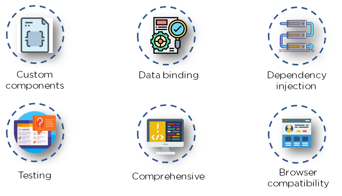
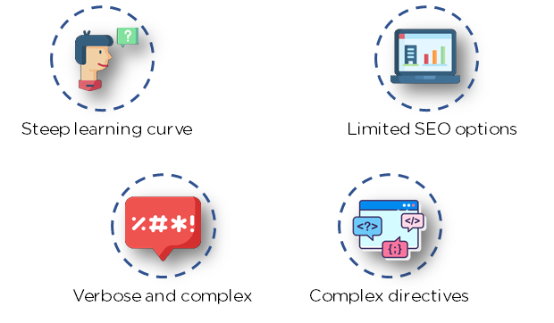
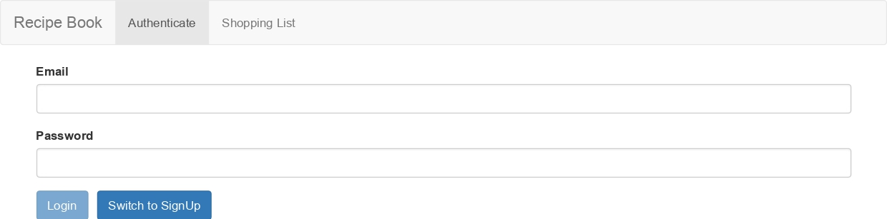

- [What is Angular](#orgc317a45)
- [Features of Angular](#orgf1e44f7)
- [Angular Architecture](#org4658ac5)
- [Advantages of Angular](#orgc16fcbb)
- [Limitations of Angular](#orgdaa3711)
- [Course Structure](#org902d077)
- [Course Project](#orgfa82387)
  - [[Angular Course Project](https://ng-course-recipe-book-4d4d5.web.app/recipes)](#org39a7919)

---

JavaScript is the most commonly used client-side scripting language. It is written into HTML documents to enable interactions with web pages in many unique ways. As a relatively easy-to-learn language with pervasive support, it is well-suited to develop modern applications.

But is JavaScript ideal for developing single-page applications that require modularity, testability, and developer productivity? Perhaps not.

These days, we have a variety of frameworks and libraries designed to provide alternative solutions. With respect to front-end web development, Angular addresses many, if not all, of the issues developers face when using JavaScript on its own.

# What is Angular

Angular is an open-source, JavaScript framework written in TypeScript. Google maintains it, and its primary purpose is to develop single-page applications. As a framework, Angular has clear advantages while also providing a standard structure for developers on a team to work with. It enables users to develop large applications in a maintainable manner.

# Features of Angular

1.  **Document Object Model** DOM (Document Object Model) treats an XML or HTML document as a tree structure in which each node represents a part of the document. Angular uses regular DOM. Consider that ten updates are made on the same HTML page. Instead of updating the ones that were already updated, Angular will update the entire tree structure of HTML tags.

2.  **TypeScript** TypeScript defines a set of types to JavaScript, which helps users write JavaScript code that is easier to understand. All of the TypeScript code compiles with JavaScript and can run smoothly on any platform. TypeScript is not compulsory for developing an Angular application. However, it is highly recommended as it offers better syntactic structure—while making the codebase easier to understand and maintain.

3.  **Data Binding** Data binding is a process that enables users to manipulate web page elements through a web browser. It employs dynamic HTML and does not require complex scripting or programming. Data binding is used in web pages that include interactive components, such as calculators, tutorials, forums, and games. It also enables a better incremental display of a web page when pages contain a large amount of data.
    
    Angular uses the two-way binding. Any changes made in the UI elements are reflected in the corresponding model state. Conversely, any changes in the model state are reflected in the UI state. This enables the framework to connect the DOM to the model data through the controller.

4.  **Testing**

Angular uses the Jasmine testing framework. The Jasmine framework provides multiple functionalities to write different kinds of test cases. Karma is the task-runner for the tests that uses a configuration file to set the start-up, reporters, and testing framework.

# Angular Architecture

Angular is a full-fledged model-view-controller (MVC) framework. It provides clear guidance on how the application should be structured and offers bi-directional data flow while providing real DOM.

Now that you know the basic features of Angular, understanding its architecture is critical if you want to work with Angular on a daily basis.

1.  **Modules** An Angular app has a root module, named AppModule, which provides the bootstrap mechanism to launch the application.

2.  **Components** Each component in the application defines a class that holds the application logic and data. A component generally defines a part of the user interface (UI).

3.  **Templates** The Angular template combines the Angular markup with HTML to modify HTML elements before they are displayed. There are two types of data binding:
    1.  **Event binding**: Lets your app respond to user input in the target environment by updating your application data.
    2.  **Property binding**: Enables users to interpolate values that are computed from your application data into the HTML.

4.  **Metadata** Metadata tells Angular how to process a class. It is used to decorate the class so that it can configure the expected behavior of a class.

5.  Services When you have data or logic that isn’t associated with the view but has to be shared across components, a service class is created. The class is always associated with the @Injectible decorator.

6.  Dependency Injection This feature lets you keep your component classes crisp and efficient. It does not fetch data from a server, validate the user input, or log directly to the console. Instead, it delegates such tasks to the services.
    
    Angular comes with its own set of advantages and disadvantages. The next two sections briefly explain them.

# Advantages of Angular

1.  **Custom Components** Angular enables users to build their own components that can pack functionality along with rendering logic into reusable pieces. It also plays well with web components.

2.  **Data Binding** Angular enables users to effortlessly move data from JavaScript code to the view, and react to user events without having to write any code manually.

3.  **Dependency Injection** Angular enables users to write modular services and inject them wherever they are needed. This improves the testability and reusability of the same services.

4.  **Testing** Tests are first-class tools, and Angular has been built from the ground up with testability in mind. You will have the ability to test every part of your application—which is highly recommended.

5.  **Comprehensive** Angular is a full-fledged framework and provides out-of-the-box solutions for server communication, routing within your application, and more.

6.  **Browser Compatibility** Angular is cross-platform and compatible with multiple browsers. An Angular application can typically run on all browsers (Eg: Chrome, Firefox) and OSes, such as Windows, macOS, and Linux.

# Limitations of Angular

1.  **Steep Learning Curve** The basic components of Angular that all users should know include directives, modules, decorators, components, services, dependency injection, pipes, and templates. More advanced topics include change detection, zones, AoT compilation, and Rx.js. For beginners, Angular 4 may be challenging to learn because it is a complete framework.

2.  **Limited SEO Options** Angular offers limited SEO options and poor accessibility to search engine crawlers.

3.  **Migration** One of the reasons why companies do not frequently use Angular is the difficulty in porting legacy js/jquery-based code to angular style architecture. Also, each new release can be troublesome to upgrade, and several of them are not backward-compatible.

4.  **Verbose and Complex** A common issue in the Angular community is the verbosity of the framework. It is also fairly complex compared to other front-end tools.

# Course Structure

-   Basics
-   Debugging
-   Components & Databinding
-   Directives
-   Services & Dependency Injection
-   Changing Pages with Routing
-   Understanding Observables
-   Handling Forms in Angular Apps
-   Using Pipes to Transform Output
-   Making Http Requests
-   Authentication & Route Protection in Angular
-   Dynamic Components
-   Angular Modules & Optimization in Angular Apps
-   Deploy an Angular App
-   Working with NgRx
-   Angular Universal / NestJs
-   Angular Animations
-   Service Workers
-   Course Project

# Course Project

## [Angular Course Project](https://ng-course-recipe-book-4d4d5.web.app/recipes)

